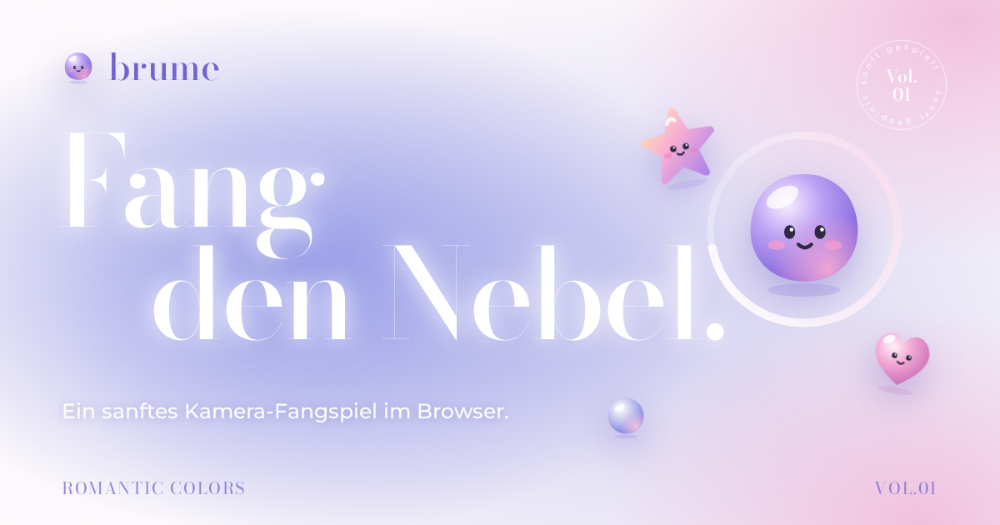

# brume – Fang den Nebel
 
Website einer fiktiven Marke für sanfte Bewegungsspiele, mit einem kleinen Kamera-Fangspiel direkt im Browser.
Fang den Nebel. brume macht kleine Bewegungsspiele für zwischendurch. Deine Kamera sieht deine Hände, und die Brümchen warten darauf, sanft eingesammelt zu werden.
 

 
## Das Spiel: Nebelfang
 
Brümchen schweben durch dein Kamerabild. Wink sie ein, bevor ihr Ring abläuft.
 
| Figur | Punkte |
| --- | --- |
| Brümchen (Kugel) | +10 |
| Herz | +15 |
| Stern | +25 |
| Grummelwolke | −15 |
 
Wer mehrere Figuren hintereinander fängt, bekommt einen Serienbonus von bis zu +100 %.
 
Vor jeder Runde wählst du:
 
- **Level:** Sanft, Munter oder Wild
- **Spieldauer:** 30 Sekunden, 1, 1,5 oder 2 Minuten
- **Steuerung:** Kamera oder Maus und Finger
Rekorde werden pro Level und Dauer lokal im Browser gespeichert.
 
### Datenschutz
 
Das Kamerabild wird ausschließlich im Browser ausgewertet. Es wird nichts hochgeladen, gespeichert oder an einen Server gesendet. Die Erkennung vergleicht aufeinanderfolgende Bilder in sehr niedriger Auflösung (64 px breit) und registriert nur, *wo* sich etwas bewegt.
 
## Projektstruktur
 
```
.
├── index.html            Seite, Styles und Spiel in einer Datei
├── og-image.png          Vorschaubild für Social Media (1200 × 630)
├── favicon.svg           Seiten-Icon
├── apple-touch-icon.png  Icon für den iOS-Homescreen
├── deploy.sh             Deploy-Skript für GitHub Pages
├── .nojekyll             verhindert die Jekyll-Verarbeitung auf GitHub
└── .gitignore
```
 
Es gibt keinen Build-Schritt und keine Abhängigkeiten. Nur die Schriften (Bodoni Moda, Montserrat) werden von Google Fonts geladen.
 
## Lokal starten
 
Die einfachste Variante: `index.html` per Doppelklick im Browser öffnen.
 
Falls dein Browser die Kamera bei `file://` blockiert, starte einen kleinen lokalen Server:
 
```bash
python3 -m http.server 8000
```
 
Danach `http://localhost:8000` öffnen. Auf `localhost` ist der Kamerazugriff erlaubt.
 
## Deploy auf GitHub Pages
 
### Mit dem Skript
 
```bash
./deploy.sh <github-name> [repo-name]
```
 
Beispiele:
 
```bash
./deploy.sh mira                  # https://mira.github.io/brume/
./deploy.sh mira nebelfang        # https://mira.github.io/nebelfang/
./deploy.sh mira mira.github.io   # https://mira.github.io/
./deploy.sh mira --dry-run        # nur URLs anpassen, ohne Git
```
 
Das Skript erledigt Folgendes:
 
1. Es trägt deine Adresse in Canonical-Link, `og:url`, `og:image` und `twitter:image` ein. Ein erneutes Ausführen mit anderem Namen funktioniert ebenfalls.
2. Es legt bei Bedarf ein Git-Repository an und committet alle Änderungen.
3. Es pusht auf den Branch `main`.
4. Ist die [GitHub CLI](https://cli.github.com/) installiert und angemeldet (`gh auth login`), erstellt es das Repo automatisch und aktiviert GitHub Pages.
Ohne GitHub CLI musst du das Repo vorher leer auf GitHub anlegen und Pages einmalig selbst einschalten: **Settings → Pages → Deploy from a branch → `main` → `/ (root)`**.
 
Unter Windows läuft das Skript in Git Bash oder WSL.
 
### Manuell
 
1. Ersetze in `index.html` alle Vorkommen von `https://DEIN-NAME.github.io/brume/` durch deine Adresse.
2. Lade alle Dateien ins Hauptverzeichnis eines Repos.
3. Aktiviere GitHub Pages wie oben beschrieben.
### Vorschaubild prüfen
 
Nach dem Deploy kannst du mit dem [Facebook Sharing Debugger](https://developers.facebook.com/tools/debug/) oder [opengraph.xyz](https://www.opengraph.xyz/) prüfen, ob Titel und Bild richtig erkannt werden. Plattformen cachen Vorschauen oft, ein erneutes Abrufen im Debugger hilft.
 
## Anpassen
 
Alles liegt in `index.html`.
 
**Farben:** Die Design-Tokens stehen ganz oben im CSS unter `:root`, mit eigenen Werten für den Dunkelmodus.
 
| Name | Wert |
| --- | --- |
| Lavendeldunst | `#969BE7` |
| Roséhauch | `#EEC1DD` |
| Nebelflieder | `#D1D0EF` |
| Milchglas | `#FCF8FB` |
| Brume-Violett | `#8B5CE6` |
| Seeglas | `#27AFA4` |
 
**Schwierigkeit:** Im Skript im Objekt `LEVELS`.
 
| Feld | Bedeutung |
| --- | --- |
| `spawn` | Sekunden zwischen neuen Figuren |
| `life` | Sekunden, bis eine Figur verschwindet |
| `size` | Größe als Anteil der Spielfläche (min, max) |
| `speed` | Fluggeschwindigkeit |
| `cloud` / `star` | Wahrscheinlichkeit für Wolken und Sterne |
| `max` | maximale Anzahl gleichzeitiger Figuren |
 
**Punkte:** im Objekt `POINTS`.
 
**Kamera-Empfindlichkeit:** In `computeMotion()` legt der Schwellwert `24` fest, ab welcher Helligkeitsänderung ein Pixel als Bewegung zählt. In `update()` bestimmt `m > .15`, welcher Anteil einer Figur bewegt sein muss. Niedrigere Werte machen das Spiel empfindlicher.
 
## Browser-Unterstützung
 
Gedacht für aktuelle Versionen von Chrome, Edge, Firefox und Safari, auf dem Desktop und mobil. Die Kamera braucht HTTPS oder `localhost`, was auf GitHub Pages automatisch gegeben ist. Ohne Kamera schaltet das Spiel automatisch auf Maus und Finger um. Wer in den Systemeinstellungen reduzierte Bewegung aktiviert hat, bekommt eine ruhigere Seite.
 
## Credits
 
- Schriften: [Bodoni Moda](https://fonts.google.com/specimen/Bodoni+Moda) und [Montserrat](https://fonts.google.com/specimen/Montserrat), beide unter der SIL Open Font License
- Figuren, Icons und Vorschaubild sind eigene Gestaltung für dieses Projekt
- brume ist eine fiktive Marke
 